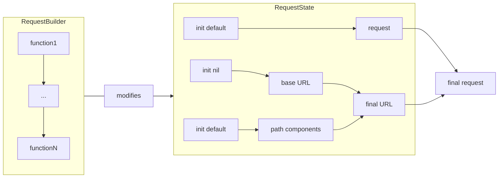

# Declarative Request Builders

[](https://github.com/sisoje/declarative-requests-swift/actions/workflows/swift.yml)

A concise and declarative way to build and modify `URLRequest` using SwiftUI-inspired state management and composable builder nodes.


## Key Concepts

- **State Management**: `RequestBuilderState` maintains the state for the `URLRequest` and `URLComponents`.
- **Builder Nodes**: Protocol-based components like `HTTPMethod`, `JSONBody`, and `QueryParams` modify `RequestBuilderState`.
- **Result Builders**: Use `RequestBuilder` to declaratively compose multiple `RequestBuilderNode` operations.

## Example Usage

```swift
let request = try URLRequest {
    HTTPMethod.POST
    BaseURL("https://google.com")
    Endpoint("/getLanguage")
    HTTPBody.data("{}".data(using: .utf8))
    URLQuery("languageId", "1")
}
```

This builds a `POST` request to `https://google.com/getLanguage?languageId=1` with `{}` body declaratively.

## Features
- **Composable Nodes**: Easily add custom `RequestBuilderNode` types.
- **Stateless Logic**: Decouples state from mutation logic.
- **Testable**: Validate requests through isolated `RequestBuilderState`.

Perfect for creating and managing HTTP requests in a clean, declarative style.
