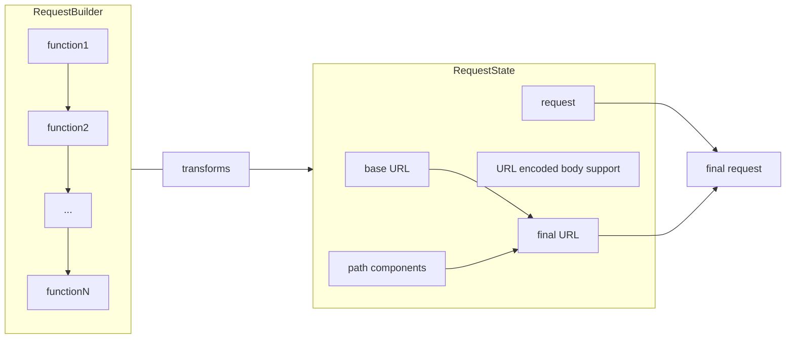

# Declarative Requests

[](https://github.com/sisoje/declarative-requests-swift/actions/workflows/swift.yml)

A concise and declarative way to build and modify `URLRequest` using SwiftUI-inspired state management and composable builder nodes.


## Key Concepts

- **Builder Nodes**: Protocol-based components like `Method`, `JSONBody`, `Query`...
- **Request Builders**: Declaratively composes node elements. **NOTE**: The request builder produces the final node with transformer function - it does **NOT** produce request.
- **Request State**: Maintains the state for the base `URL`, `URLRequest` and `URLComponents`
- **Final Request**: Computed by applying transformer function on a request state. Transformer function is ofcorse stateless and can be re-applied on any request state.

## Example Usage

```swift
let request = try URLRequest {
    Method.POST
    BaseURL("https://google.com")
    Endpoint("/getLanguage")
    JSONBody([1])
    Query("languageId", "1")
}
```

This builds a `POST` request to `https://google.com/getLanguage?languageId=1` with a proper body.

## Features
- **Composable Nodes**: Easily add custom `BuilderNode` types.
- **Stateless Logic**: Decouples state from mutation logic.
- **Testable**: Validate requests through isolated `RequestState`.

Perfect for creating and managing HTTP requests in a clean, declarative style.
