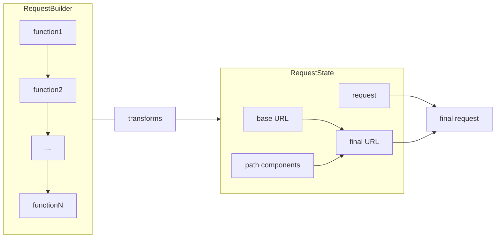

# Declarative Requests

[](https://github.com/sisoje/declarative-requests-swift/actions/workflows/swift.yml)

A concise and declarative way to build and modify `URLRequest` using SwiftUI-inspired state management and composable builder nodes.


```mermaid
flowchart LR

    RequestBuilder --- transforms ---> RequestState

    subgraph RequestState
        baseUrl["base URL"]
        request
        path["path components"]
        baseUrl --> finalUrl["final URL"]
        path --> finalUrl
    end

    request --> FinalRequest["final request"]
    finalUrl --> FinalRequest

    subgraph RequestBuilder
        function1 --> function2
        function2 --> dots["..."]
        dots --> functionN
    end
```

## Key Concepts

- **Builder Nodes**: Protocol-based components like `Method`, `JSONBody`, `Query`...
- **Request Builders**: Declaratively composes node elements. **NOTE**: The request builder produces the final node with transformer function — it does **NOT** produce a request.
- **Request State**: Maintains the state for the base `URL`, `URLRequest` and `URLComponents`.
- **Final Request**: Computed by applying the transformer function on a request state. The transformer is stateless and can be re-applied on any request state.

## Example Usage

```swift
let request = try URLRequest {
    Method.POST
    BaseURL("https://google.com")
    Endpoint("/getLanguage")
    JSONBody([1])
    Query("languageId", "1")
}
```

This builds a `POST` request to `https://google.com/getLanguage?languageId=1` with a proper body.

You can also build from a `URL` value:

```swift
let request = try URL(string: "https://google.com")!.buildRequest {
    Method.GET
    Path("v1", "languages")
}
```

## Available blocks

### URL & path
- `BaseURL(_ url:)` / `BaseURL(_ string:)` — set the base URL.
- `Endpoint(_ path:)` — replace the URL path.
- `Path("a", "b", ...)` — append slash-joined segments to the existing path.
- `Query(_ name:_ value:)` / `Query(_ encodable:)` — append query items.

### Method & headers
- `Method.GET` / `.POST` / `.PUT` / `.DELETE` / ... or `Method.custom("…")`.
- `Header.contentType.setValue("…")` / `.addValue("…")`.
- `Headers("X-Trace", "abc")` — single name/value (literal name).
- `Headers(.referer, "https://…")` — single header keyed by the `Header` enum.
- `Headers(["X-A": "1", ...])` / `Headers([.accept: "application/json", ...])` — bulk-set from a map.
- `Headers(MyHeadersModel())` — flatten an `Encodable` model into headers.
- `ContentType.JSON` / `.XML` / `.URLEncoded` / ...
- `Cookie("name", "value")`.
- `Authorization(bearer: "…")` or `Authorization(username: "…", password: "…")`.

### Bodies
- `JSONBody(_ encodable:)` — JSON-encoded body, sets Content-Type.
- `URLEncodedBody(_ name:_ value:)` / `URLEncodedBody(_ encodable:)`.
- `Body(_ data:type:)` / `Body(_ string:type:)` — raw body bytes plus optional Content-Type.
- `MultipartBody { … }` — `multipart/form-data` with field, data, and file parts.
- `StreamBody(_ stream:)` — stream the body from an `InputStream`.

### Networking knobs
- `Timeout(_ seconds:)`.
- `CachePolicy(.reloadIgnoringLocalCacheData)`.
- `NetworkServiceType(.background)`.
- `HTTPShouldHandleCookies(false)`.
- `AllowAccess.cellular(true)` / `.expensiveNetwork(true)` / `.constrainedNetwork(true)`.

## Multipart

```swift
let request = try URLRequest {
    Method.POST
    BaseURL("https://api.example.com")
    Endpoint("/upload")
    MultipartBody {
        MultipartPart.field(name: "user", value: "alice")
        MultipartPart.data(name: "avatar", filename: "a.png", data: pngBytes, type: .PNG)
        for url in fileURLs {
            MultipartPart.file(name: "files", fileURL: url, type: .Stream)
        }
    }
}
```

## Sending requests

For a one-line build-and-send through `URLSession`:

```swift
let (data, response) = try await URLSession.shared.data {
    Method.GET
    BaseURL("https://api.example.com")
    Endpoint("/users/123")
}

// Decoding directly:
struct User: Decodable { let id: Int; let name: String }
let user = try await URLSession.shared.decode(User.self) {
    Method.GET
    BaseURL("https://api.example.com")
    Endpoint("/users/123")
}
```

## Debugging

Every `URLRequest` exposes a copy-pasteable curl equivalent:

```swift
print(request.curlCommand)
// curl -X POST -H 'Content-Type: application/json' --data-binary '{"x":1}' 'https://api.example.com/foo'
```

## Features

- **Composable Nodes**: Easily add custom `RequestBuildable` types.
- **Stateless Logic**: Decouples state from mutation logic.
- **Testable**: Validate requests through isolated `RequestState`.
- **Concurrency-friendly**: Public block types and the transform closure are `Sendable`.

Perfect for creating and managing HTTP requests in a clean, declarative style.
