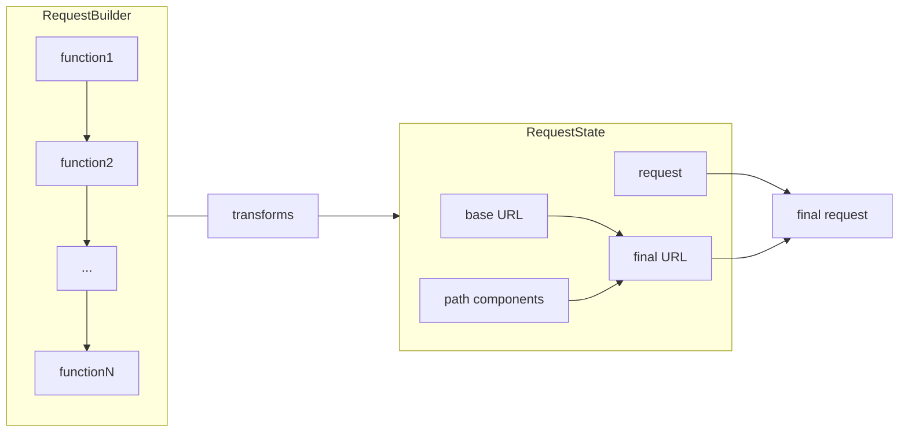
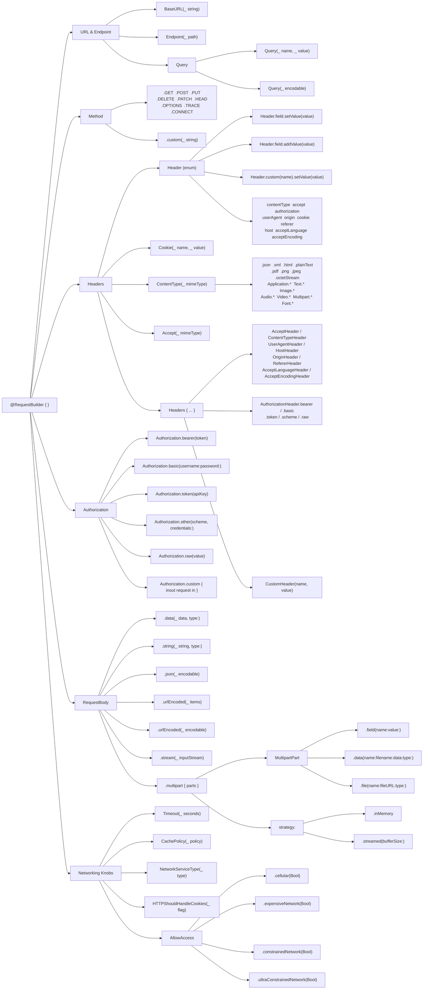

# Declarative Requests

[](https://github.com/sisoje/declarative-requests-swift/actions/workflows/swift.yml)

A SwiftUI-style result builder for composing `URLRequest`. Each block in the
builder maps onto one piece of a raw HTTP request — read the builder top to
bottom and you read the request top to bottom.

```http
POST /v1/login HTTP/1.1
Host: api.example.com
Accept: application/json
Authorization: Bearer eyJhbGci...
Content-Type: application/json

{"email":"alice@example.com","password":"hunter2"}
```

```swift
let request = try URLRequest {
    Method.POST
    BaseURL("https://api.example.com")
    Endpoint("/v1/login")
    Header.accept.setValue("application/json")
    Authorization.bearer(token)
    RequestBody.json(LoginRequest(email: email, password: password))
}
```

`Header.accept.setValue(...)` is one HTTP header line. `RequestBody.json(...)` is the body
section. The block order roughly mirrors the wire order.

## Block reference

One type per request property. Pick the factory or initializer that matches
the data you have.

### URL & path

| Block | What it does | Example |
|---|---|---|
| `BaseURL(_:)` | Sets host/scheme; preserves any path/query already declared. | `BaseURL("https://api.example.com")` |
| `Endpoint(_:)` | Resolves the path against the current URL using RFC 3986 reference resolution (like Python's `urljoin`). A leading `/` resets to root, bare segments append. | `Endpoint("/users/\(id)/posts")` |
| `Query(_ name:, _ value:)` | Append a single query item (accumulates). | `Query("page", "2")` |
| `Query(_ encodable:)` | Flatten an `Encodable` model into query items. | `Query(filterModel)` |

### Method, headers, cookies, auth

| Block | What it does | Example |
|---|---|---|
| `Method.GET` / `.POST` / `.PUT` / … / `.custom("LINK")` | Sets the HTTP method. | `Method.POST` |
| `Header.field.setValue(_:)` | Sets a header field, replacing any previous value. | `Header.accept.setValue("application/json")` |
| `Header.field.addValue(_:)` | Appends a value without removing existing ones. | `Header.accept.addValue("text/html")` |
| `Header.custom(_:).setValue(_:)` | Sets a header by raw string name. | `Header.custom("X-Trace-Id").setValue("abc123")` |
| `Cookie(_ name:, _ value:)` | Adds one cookie to the `Cookie` header (accumulates). | `Cookie("session", token)` |
| `Authorization.bearer(_:)` | `Authorization: Bearer …` (RFC 6750) | `Authorization.bearer(token)` |
| `Authorization.basic(username:password:)` | `Authorization: Basic …` (RFC 7617, Base64-encoded) | `Authorization.basic(username: u, password: p)` |
| `Authorization.token(_:)` | `Authorization: Token …` (e.g. Django REST) | `Authorization.token(apiKey)` |
| `Authorization.other(_:credentials:)` | `Authorization: <Scheme> <credentials>` | `Authorization.other("HOBA", credentials: "…")` |
| `Authorization.raw(_:)` | Verbatim value, no scheme prefix | `Authorization.raw("opaque-key")` |
| `Authorization.custom { … }` | Closure receives `inout URLRequest` for computed auth | `Authorization.custom { req in … }` |
| `ContentType(_:)` | Sets `Content-Type` from a `MIMEType`. | `ContentType(.json)` |
| `Accept(_:)` | Accumulates `Accept` header values. | `Accept(.json)` |

### Grouped headers

The top-level `Header.*` and `Authorization.*` blocks work directly inside a request.
When you want to keep header declarations visually together — or vary the whole group
conditionally — wrap them in `Headers { … }` and use the typed header nodes. The grouping
builder only accepts ``HeaderBuildable`` values; anything else is a compile-time error.

```swift
let request = try URLRequest {
    Method.GET
    BaseURL("https://api.example.com")
    Endpoint("/users")

    Headers {
        AcceptHeader(.json)
        UserAgentHeader("MyApp/1.0")
        AuthorizationHeader.bearer(token)
        CustomHeader("X-Trace-Id", "abc123")
        if isStaging {
            CustomHeader("X-Env", "staging")
        }
    }
}
```

Each typed node defaults to either set or add semantics, and you can flip the mode
explicitly with `.replacing()` / `.appending()`:

| Node | Default mode | Notes |
|---|---|---|
| `AcceptHeader(_:)` | `set` | Pass a `MIMEType` or a raw string. Use `.appending()` to accumulate, `.quality(_:)` for a weighted entry. |
| `ContentTypeHeader(_:)` | `set` | Pass a `MIMEType` or a raw string. |
| `UserAgentHeader(_:)` | `set` | Last one wins. |
| `AuthorizationHeader.bearer(_:)` / `.basic(username:password:)` / `.token(_:)` / `.scheme(_:value:)` / `.raw(_:)` | `set` | Matches the top-level `Authorization` factories. |
| `HostHeader` / `OriginHeader` / `RefererHeader` / `AcceptLanguageHeader` / `AcceptEncodingHeader` | `set` | Single-value headers. |
| `CustomHeader(_ name:, _ value:)` | `add` | Use `.replacing()` to flip to set. |

### Body — one type, many factories

`RequestBody` is **the** body block. The factory you pick decides how the
bytes are produced and what (if any) `Content-Type` is set:

| Factory | What you supply | Sets `Content-Type` |
|---|---|---|
| `RequestBody.data(_ data:type:)` | `Data` + optional `ContentType` | only if you pass `type:` |
| `RequestBody.string(_ s:type:)` | `String` (UTF-8) + `ContentType` | yes (defaults `text/plain`) |
| `RequestBody.json(_ value:)` | `Encodable` value | `application/json` |
| `RequestBody.urlEncoded(_ items:)` | `[URLQueryItem]` | `application/x-www-form-urlencoded` |
| `RequestBody.urlEncoded(_ encodable:)` | `Encodable` (incl. `[String:String]`) | `application/x-www-form-urlencoded` |
| `RequestBody.stream(_ stream:)` | `InputStream` (autoclosure) | no — pair with `ContentType(…)` if needed |
| `RequestBody.multipart { parts }` | `MultipartPart`s, in-memory | `multipart/form-data; boundary=…` |
| `RequestBody.multipart(strategy: .streamed()) { parts }` | `MultipartPart`s, streamed from disk | `multipart/form-data; boundary=…` + `Content-Length` |

The body is *replaced* by each `RequestBody.*` block — last one wins. To
collect form items across iterations, build the array first and pass it
once.

### Networking knobs

| Block | What it does |
|---|---|
| `Timeout(_ seconds:)` | `request.timeoutInterval` |
| `CachePolicy(.reloadIgnoringLocalCacheData)` | `request.cachePolicy` |
| `NetworkServiceType(.background)` | `request.networkServiceType` |
| `HTTPShouldHandleCookies(false)` | `request.httpShouldHandleCookies` |
| `AllowAccess.cellular(true)` etc. | `allowsCellularAccess` / `allowsExpensiveNetworkAccess` / `allowsConstrainedNetworkAccess` / `allowsUltraConstrainedNetworkAccess` |

## Multipart upload

```swift
let request = try URLRequest {
    Method.POST
    BaseURL("https://api.example.com")
    Endpoint("/upload")
    RequestBody.multipart {
        MultipartPart.field(name: "user", value: "alice")
        MultipartPart.data(name: "avatar", filename: "a.png", data: pngBytes, type: .png)
        for url in fileURLs {
            MultipartPart.file(name: "files", fileURL: url, type: .octetStream)
        }
    }
}
```

For very large uploads, switch to streaming so memory use stays bounded:

```swift
RequestBody.multipart(strategy: .streamed(bufferSize: 64 * 1024)) {
    MultipartPart.field(name: "title", value: "Vacation 2026")
    MultipartPart.file(name: "video", fileURL: hugeVideoURL, type: .Video.mp4)
}
```

Both strategies follow RFC 7578: form-field and filename parameters are quoted, `\` and
`"` characters are escaped, CR/LF in names is stripped (no header injection), and a
boundary containing whitespace or special characters is quoted in the `Content-Type`
header. The streamed strategy additionally sets `Content-Length` up front by stat'ing
each file, so the server sees the full payload size before bytes start flowing.

## Building from a base URL

If you already have a `URL` value, use `buildRequest`:

```swift
let request = try api.buildRequest {
    Method.GET
    Endpoint("/v1/users/\(userId)")
    Header.accept.setValue("application/json")
}
```

Otherwise declare the URL inside the builder with `BaseURL`:

```swift
let request = try URLRequest {
    Method.POST
    BaseURL("https://api.example.com")
    Endpoint("/login")
    RequestBody.json(credentials)
}
```

## Repository pattern

Declare an endpoint surface as a struct of `@RequestBuilder` closures and
materialize requests on demand. Keeps URL construction out of call sites
and makes endpoints easy to mock in tests.

```swift
struct UserRepository {
    @RequestBuilder var getUser: (_ id: String) -> any RequestBuildable
    @RequestBuilder var refreshToken: (_ token: String) -> any RequestBuildable
}

extension UserRepository {
    static func live(baseURL: URL, tokenProvider: @escaping () -> String?) -> Self {
        .init(
            getUser: { id in
                Method.GET
                BaseURL(baseURL)
                Endpoint("/v1/users/\(id)")
                if let t = tokenProvider() { Authorization.bearer(t) }
            },
            refreshToken: { token in
                Method.POST
                BaseURL(baseURL)
                Endpoint("/v1/auth/refresh")
                RequestBody.json(["token": token])
            }
        )
    }
}

let request = try repo.getUser("42").request
```

## Debugging

Every `URLRequest` exposes a copy-pasteable `curl` equivalent:

```swift
print(request.curlCommand)
// curl -X POST -H 'Content-Type: application/json' --data-binary '{"x":1}' 'https://api.example.com/foo'
```

## Architecture sketch


```mermaid
flowchart LR
    RequestBuilder --- transforms ---> RequestState

    subgraph RequestState
        baseUrl["base URL"]
        request
        path["path components"]
        baseUrl --> finalUrl["final URL"]
        path --> finalUrl
    end

    request --> FinalRequest["final request"]
    finalUrl --> FinalRequest

    subgraph RequestBuilder
        function1 --> function2
        function2 --> dots["..."]
        dots --> functionN
    end
```

## Block map

Every block and its variants at a glance:


```mermaid
flowchart LR
    RB["@RequestBuilder { }"]

    %% URL & Endpoint
    RB --> URL_GROUP["URL & Endpoint"]
    URL_GROUP --> BaseURL["BaseURL(_ string)"]
    URL_GROUP --> Endpoint["Endpoint(_ path)"]
    URL_GROUP --> Query
    Query --> Q1["Query(_ name, _ value)"]
    Query --> Q2["Query(_ encodable)"]

    %% Method
    RB --> MethodGroup["Method"]
    MethodGroup --> MSTD[".GET  .POST  .PUT\n.DELETE  .PATCH  .HEAD\n.OPTIONS  .TRACE  .CONNECT"]
    MethodGroup --> MCUSTOM[".custom(_ string)"]

    %% Headers
    RB --> HeaderGroup["Headers"]
    HeaderGroup --> Header["Header (enum)"]
    Header --> H1["Header.field.setValue(value)"]
    Header --> H2["Header.field.addValue(value)"]
    Header --> H3["Header.custom(name).setValue(value)"]
    Header --> HFields["contentType  accept  authorization\nuserAgent  origin  cookie  referer\nhost  acceptLanguage  acceptEncoding"]
    HeaderGroup --> Cookie["Cookie(_ name, _ value)"]
    HeaderGroup --> ContentType["ContentType(_ mimeType)"]
    ContentType --> CTJSON[".json  .xml  .html  .plainText\n.pdf  .png  .jpeg  .octetStream\nApplication.*  Text.*  Image.*\nAudio.*  Video.*  Multipart.*  Font.*"]
    HeaderGroup --> AcceptBlock["Accept(_ mimeType)"]
    HeaderGroup --> HeadersGroup["Headers { ... }"]
    HeadersGroup --> HT1["AcceptHeader / ContentTypeHeader\nUserAgentHeader / HostHeader\nOriginHeader / RefererHeader\nAcceptLanguageHeader / AcceptEncodingHeader"]
    HeadersGroup --> HT2["AuthorizationHeader.bearer / .basic\n.token / .scheme / .raw"]
    HeadersGroup --> HT3["CustomHeader(name, value)"]

    %% Auth
    RB --> AuthGroup["Authorization"]
    AuthGroup --> A1["Authorization.bearer(token)"]
    AuthGroup --> A2["Authorization.basic(username:password:)"]
    AuthGroup --> A3["Authorization.token(apiKey)"]
    AuthGroup --> A4["Authorization.other(scheme, credentials:)"]
    AuthGroup --> A5["Authorization.raw(value)"]
    AuthGroup --> A6["Authorization.custom { inout request in }"]

    %% Body
    RB --> BodyGroup["RequestBody"]
    BodyGroup --> B1[".data(_ data, type:)"]
    BodyGroup --> B2[".string(_ string, type:)"]
    BodyGroup --> B3[".json(_ encodable)"]
    BodyGroup --> B4[".urlEncoded(_ items)"]
    BodyGroup --> B5[".urlEncoded(_ encodable)"]
    BodyGroup --> B6[".stream(_ inputStream)"]
    BodyGroup --> B7[".multipart { parts }"]
    B7 --> MP["MultipartPart"]
    MP --> MP1[".field(name:value:)"]
    MP --> MP2[".data(name:filename:data:type:)"]
    MP --> MP3[".file(name:fileURL:type:)"]
    B7 --> MS["strategy:"]
    MS --> MS1[".inMemory"]
    MS --> MS2[".streamed(bufferSize:)"]

    %% Networking knobs
    RB --> NetGroup["Networking Knobs"]
    NetGroup --> Timeout["Timeout(_ seconds)"]
    NetGroup --> CachePolicy["CachePolicy(_ policy)"]
    NetGroup --> NST["NetworkServiceType(_ type)"]
    NetGroup --> HSHC["HTTPShouldHandleCookies(_ flag)"]
    NetGroup --> AllowAccess
    AllowAccess --> AA1[".cellular(Bool)"]
    AllowAccess --> AA2[".expensiveNetwork(Bool)"]
    AllowAccess --> AA3[".constrainedNetwork(Bool)"]
    AllowAccess --> AA4[".ultraConstrainedNetwork(Bool)"]
```

## Key concepts

- **`RequestBuildable`** — the protocol every block conforms to.
- **`RequestBuilder`** — the `@resultBuilder` that stitches blocks together.
- **`RequestBlock`** — the leaf block; holds a closure that mutates `RequestState`.
- **`RequestState`** — the in-progress `URLRequest` plus the `JSONEncoder` that body / header / query blocks use.
- **`URLRequest { … }.request`** — applies the composed transform to a fresh `RequestState` and returns the finished `URLRequest`.
