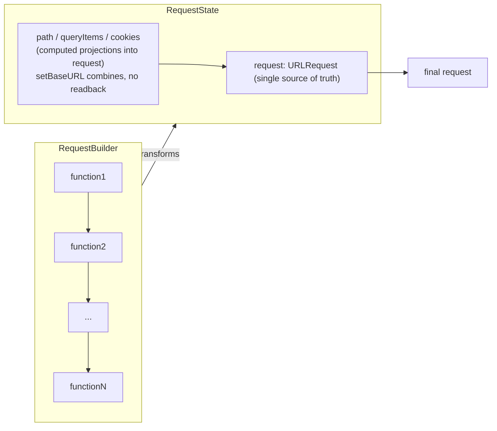
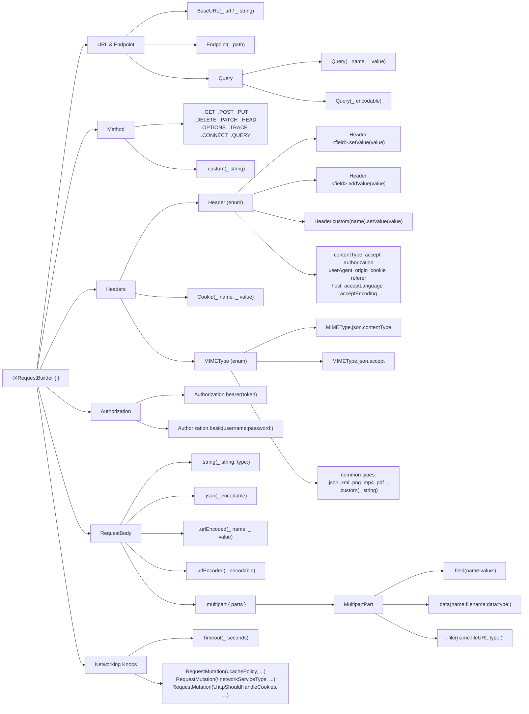

# Declarative Requests: Open Spec Done Right

[](https://github.com/sisoje/swift-declarative-requests/actions/workflows/swift.yml)
[](https://swiftpackageindex.com/sisoje/swift-declarative-requests)
[](https://swiftpackageindex.com/sisoje/swift-declarative-requests)

Describe your backend in Swift — checked by the compiler, verified by your
tests, composable by construction — instead of a YAML spec that drifts.

A SwiftUI-style result builder for composing `URLRequest` — fully composable:
blocks compose into endpoint specs, specs compose with auth, auth composes
with environment, the same primitive at every level. Each block maps onto one
piece of a raw HTTP request — read the builder top to bottom and you read the
request top to bottom.

```http
POST /v1/login HTTP/1.1
Host: api.example.com
Accept: application/json
Authorization: Bearer eyJhbGci...
Content-Type: application/json

{"email":"alice@example.com","password":"hunter2"}
```

```swift
let request = try RequestBlock {
    Method.POST
    Endpoint("v1/login")
    Header.accept.setValue("application/json")
    RequestBody.json(LoginRequest(email: email, password: password))
    Authorization.bearer(token)
    BaseURL("https://api.example.com")
}.request
```

`Header.accept.setValue(...)` is one HTTP header line. `RequestBody.json(...)` is the body
section. The block order roughly mirrors the wire order.

## Open Spec

Describe your backend as an enum: one case per endpoint — a backend is a
finite set of endpoints, so the spec is a closed type. Materializing a
request is three composable steps, one per axis:

1. **The case** — definition: what the endpoint is.
2. **The authorized step** — session: `authorized(token:)`. The spec declares
   `needsAuth` per endpoint as a static fact; a protected endpoint with a nil
   token **fails the build** with the spec's own error — a half-authorized
   request can never reach the wire.
3. **The environment** — `.base(_:)`, a layer like any other, applied at the
   very end. Materializing (`.request`) is the only terminal step.

```swift
// the spec: endpoints, auth requirements, request shapes
enum UserEndpoint {
    case getUser(id: String)
    case refreshToken(token: String)

    var needsAuth: Bool {
        switch self {
        case .getUser: true
        case .refreshToken: false
        }
    }

    @RequestBuilder var spec: some RequestBuildable {
        switch self {
        case let .getUser(id):
            Method.GET
            Endpoint("v1/users/\(id)")
        case let .refreshToken(token):
            Method.POST
            Endpoint("v1/auth/refresh")
            RequestBody.json(["token": token])
        }
    }
}

// the session layer: spec + token -> authorized block
extension UserEndpoint {
    struct MissingToken: Error {}

    func authorized(token: String?) -> some RequestBuildable {
        RequestBlock {
            spec
            if needsAuth {
                if let token {
                    Authorization.bearer(token)
                } else {
                    RequestBlock { _ in throw MissingToken() }
                }
            }
        }
    }
}
```

Every layer has the same shape — `some RequestBuildable` in, `some
RequestBuildable` out — so the whole pipeline is one chain, and your app
wires session and environment exactly once:

```swift
// wire session and environment once
func request(_ endpoint: UserEndpoint) throws -> URLRequest {
    try endpoint
        .authorized(token: session.token)
        .base(environment.baseURL)
        .request
}

let request = try request(.getUser(id: "42"))
```

Every step returns a block, so layers compose: the spec drops into the
authorized wrapper, the authorized block drops into the environment builder.
`MissingToken` is the app's error, not the library's — whether a missing
token is a failure is the spec's business rule.

This is the "Open Spec Done Right" from the top of this README — the spec
is code, so nothing drifts.

## Block reference

One type per request property — you never touch the raw `URLRequest` fields
directly, each has exactly one typed block over it:

| Raw `URLRequest` field | Block |
|---|---|
| `httpMethod` | `Method.GET` … `.custom(_)` |
| `url` | `BaseURL` / `Endpoint` / `Query` |
| `allHTTPHeaderFields` | `Header.<field>.setValue/addValue`, `MIMEType.<case>.accept/.contentType`, `Cookie`, `Authorization` |
| `httpBody` / `httpBodyStream` | `RequestBody.*` encoders; raw bytes and streams via `RequestMutation` |
| `timeoutInterval` | `Timeout(5)` |
| `cachePolicy` | `RequestMutation(\.cachePolicy, .returnCacheDataElseLoad)` |
| `networkServiceType` | `RequestMutation(\.networkServiceType, .background)` |
| `httpShouldHandleCookies` | `RequestMutation(\.httpShouldHandleCookies, false)` |
| `allowsCellularAccess` etc. | `RequestMutation(\.allowsCellularAccess, false)` etc. |

For a field without a block, `RequestMutation(\.keyPath, value)` is the
one-line escape hatch, and a raw `RequestBlock { state in … }` closure is the
last resort.

Pick the factory or initializer that matches the data you have.

### URL & path

| Block | What it does | Example |
|---|---|---|
| `BaseURL(_:)` | Combines into what's built: scheme/host/port, and its path is always a **prefix**. Apply it **last** (or chain `.base(_:)` after the block). | `BaseURL("https://api.example.com/api")` |
| `Endpoint(_:)` | Sets the path; applying `BaseURL` prefixes it with the base's path. | `Endpoint("users/\(id)/posts")` |
| `Query(_ name:, _ value:)` | Append a single query item (accumulates). | `Query("page", "2")` |
| `Query(_ encodable:)` | Flatten an `Encodable` model into query items. | `Query(filterModel)` |

### Method, headers, cookies, auth

| Block | What it does | Example |
|---|---|---|
| `Method.GET` / `.POST` / … / `.custom("LINK")` | Sets the HTTP method. | `Method.POST` |
| `Header.<field>.setValue(_:)` | Sets a header field, replacing any previous value. | `Header.accept.setValue("application/json")` |
| `Header.<field>.addValue(_:)` | Appends a value without removing existing ones. | `Header.accept.addValue("text/html")` |
| `Header.custom(_:).setValue(_:)` | Sets a header by raw string name. | `Header.custom("X-Trace-Id").setValue("abc123")` |
| `Cookie(_ name:, _ value:)` | Adds one cookie to the `Cookie` header (accumulates). | `Cookie("session", token)` |
| `Authorization.bearer(_:)` | `Authorization: Bearer …` (RFC 6750) | `Authorization.bearer(token)` |
| `Authorization.basic(username:password:)` | `Authorization: Basic …` (RFC 7617, Base64-encoded) | `Authorization.basic(username: u, password: p)` |
| `MIMEType.<case>.contentType` | Sets `Content-Type` (replaces). | `MIMEType.json.contentType` |
| `MIMEType.<case>.accept` | Accumulates `Accept` header values. | `MIMEType.custom("application/vnd.x").accept` |

They go directly in the request — `setValue` replaces, `addValue` accumulates:

```swift
let request = try RequestBlock {
    Method.GET
    Endpoint("users")

    MIMEType.json.accept
    Header.userAgent.setValue("MyApp/1.0")
    Header.custom("X-Trace-Id").setValue("abc123")
    if isStaging {
        Header.custom("X-Env").setValue("staging")
    }
    Authorization.bearer(token)
    BaseURL("https://api.example.com")
}.request
```

`BaseURL` goes last — everything before it accumulates the relative part of the
URL, and the base resolves it — declare `BaseURL` last or chain `.base(_:)`.
This split is deliberate — the canonical order is three layers, each varying on
a different axis:

1. **Definition** — method, path, query, headers, body: the backend's spec, identical everywhere.
2. **Authorization** — who is asking. Varies per session, and only endpoints that need it carry the `Authorization` block — public endpoints simply don't have it.
3. **Base URL** — where it runs. Varies per environment; `BaseURL` comes last.

Endpoints are definition; authorization and the base URL are configuration on two different axes.

### Body — one type, many factories

`RequestBody` is **the** body block. The factory you pick decides how the
bytes are produced and what (if any) `Content-Type` is set:

| Factory | What you supply | Sets `Content-Type` |
|---|---|---|
| `RequestBody.string(_ s:type:)` | `String` (UTF-8) + content-type string | yes (defaults `text/plain`) |
| `RequestBody.json(_ value:)` | `Encodable` value | `application/json` |
| `RequestBody.urlEncoded(_ name:, _ value:)` | one form field (accumulates across blocks/loops) | `application/x-www-form-urlencoded` |
| `RequestBody.urlEncoded(_ encodable:)` | `Encodable` (incl. `[String:String]`) | `application/x-www-form-urlencoded` |
| `RequestBody.multipart { parts }` | `MultipartPart`s | `multipart/form-data; boundary=…` |

Raw bytes: `RequestMutation(\.httpBody, data)`; streams: `RequestMutation(\.httpBodyStream, InputStream(data: data))` (RequestMutation's autoclosure value re-creates the single-use stream per build). Pair with `MIMEType.<case>.contentType` if needed.

Each `RequestBody.*` block replaces the body — except `urlEncoded`, which
merges its items into an existing form body, so form fields can accumulate
across blocks and loops.

`Encodable`-driven blocks (`json`, `urlEncoded`, `Query`) use the
builder's `JSONEncoder`. Swap it with `.useEncoder(_:)` on any block group:

```swift
let request = try RequestBlock {
    RequestBody.json(model)   // encoded with snake_case keys
    BaseURL("https://api.example.com")
}.useEncoder(snakeCaseEncoder).request
```

### Networking knobs

| Block | What it does |
|---|---|
| `Timeout(_ seconds:)` | `request.timeoutInterval` |

## Multipart upload

```swift
let request = try RequestBlock {
    Method.POST
    Endpoint("upload")
    RequestBody.multipart {
        MultipartPart.field(name: "user", value: "alice")
        MultipartPart.data(name: "avatar", filename: "a.png", data: pngBytes, type: "image/png")
        for url in fileURLs {
            MultipartPart.file(name: "files", fileURL: url, type: "application/octet-stream")
        }
    }
    BaseURL("https://api.example.com")
}.request
```

The encoder follows RFC 7578: form-field and filename parameters are quoted, `\` and
`"` characters are escaped, CR/LF in names is stripped (no header injection), and a
boundary containing whitespace or special characters is quoted in the `Content-Type`
header. For very large uploads, write the assembled body to a temp file and hand it to
`URLSession.uploadTask(fromFile:)` — the OS streams it and replays it on redirects.

## Building from a base URL

If you already have a `URL` value, chain it as the base:

```swift
let request = try RequestBlock {
    Method.GET
    Endpoint("v1/users/\(userId)")
    Header.accept.setValue("application/json")
}
.base(api)
.request
```

Otherwise declare the URL inside the builder with `BaseURL`:

```swift
let request = try RequestBlock {
    Method.POST
    Endpoint("login")
    RequestBody.json(credentials)
    BaseURL("https://api.example.com")
}.request
```

## Architecture sketch


```mermaid
flowchart LR
    RequestBuilder -- transforms --> RequestState

    subgraph RequestState
        request["request: URLRequest (single source of truth)"]
        proj["path / queryItems / cookies<br/>(computed projections into request)<br/>setBaseURL combines, no readback"]
        proj --> request
    end

    request --> FinalRequest["final request"]

    subgraph RequestBuilder
        function1 --> function2
        function2 --> dots["..."]
        dots --> functionN
    end
```

## Block map

Every block and its variants at a glance:


```mermaid
flowchart LR
    RB["@RequestBuilder { }"]

    %% URL & Endpoint
    RB --> URL_GROUP["URL & Endpoint"]
    URL_GROUP --> BaseURL["BaseURL(_ url / _ string)"]
    URL_GROUP --> Endpoint["Endpoint(_ path)"]
    URL_GROUP --> Query
    Query --> Q1["Query(_ name, _ value)"]
    Query --> Q2["Query(_ encodable)"]

    %% Method
    RB --> MethodGroup["Method"]
    MethodGroup --> MSTD[".GET  .POST  .PUT<br/>.DELETE  .PATCH  .HEAD<br/>.OPTIONS  .TRACE  .CONNECT  .QUERY"]
    MethodGroup --> MCUSTOM[".custom(_ string)"]

    %% Headers
    RB --> HeaderGroup["Headers"]
    HeaderGroup --> Header["Header (enum)"]
    Header --> H1["Header.&lt;field&gt;.setValue(value)"]
    Header --> H2["Header.&lt;field&gt;.addValue(value)"]
    Header --> H3["Header.custom(name).setValue(value)"]
    Header --> HFields["contentType  accept  authorization<br/>userAgent  origin  cookie  referer<br/>host  acceptLanguage  acceptEncoding"]
    HeaderGroup --> Cookie["Cookie(_ name, _ value)"]
    HeaderGroup --> MIME["MIMEType (enum)"]
    MIME --> MIME1["MIMEType.json.contentType"]
    MIME --> MIME2["MIMEType.json.accept"]
    MIME --> MIMEC["common types:<br/>.json  .xml  .png  .mp4  .pdf ...<br/>.custom(_ string)"]

    %% Auth
    RB --> AuthGroup["Authorization"]
    AuthGroup --> A1["Authorization.bearer(token)"]
    AuthGroup --> A2["Authorization.basic(username:password:)"]

    %% Body
    RB --> BodyGroup["RequestBody"]
    BodyGroup --> B2[".string(_ string, type:)"]
    BodyGroup --> B3[".json(_ encodable)"]
    BodyGroup --> B4[".urlEncoded(_ name, _ value)"]
    BodyGroup --> B5[".urlEncoded(_ encodable)"]
    BodyGroup --> B7[".multipart { parts }"]
    B7 --> MP["MultipartPart"]
    MP --> MP1[".field(name:value:)"]
    MP --> MP2[".data(name:filename:data:type:)"]
    MP --> MP3[".file(name:fileURL:type:)"]

    %% Networking knobs
    RB --> NetGroup["Networking Knobs"]
    NetGroup --> Timeout["Timeout(_ seconds)"]
    NetGroup --> RM["RequestMutation(\.cachePolicy, ...)<br/>RequestMutation(\.networkServiceType, ...)<br/>RequestMutation(\.httpShouldHandleCookies, ...)"]
```

## Key concepts

- **`RequestBuildable`** — the protocol every block conforms to.
- **`RequestBuilder`** — the `@resultBuilder` that stitches blocks together.
- **`RequestBlock`** — the leaf block; holds a closure that mutates `RequestState`.
- **`RequestState`** — the in-progress `URLRequest` plus the `JSONEncoder` that body / header / query blocks use.
- **`.request`** — the only terminal: applies the composed transform to a fresh `RequestState` and returns the finished `URLRequest`.
