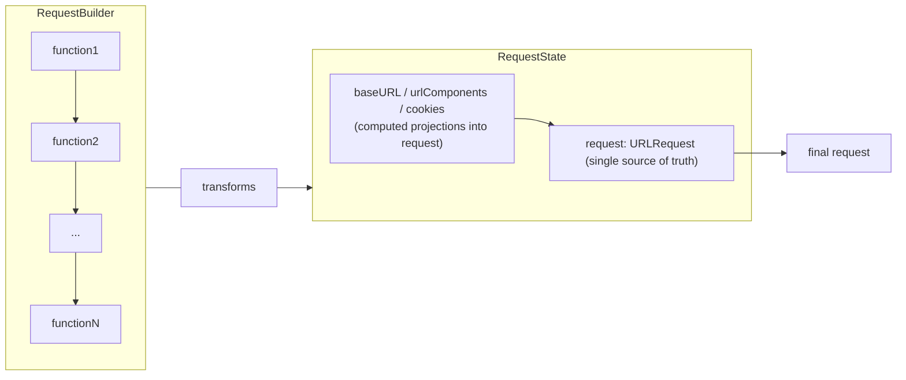
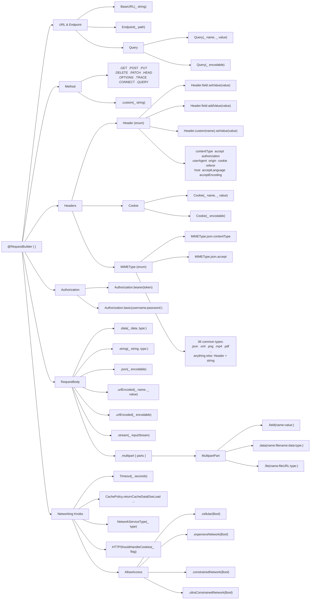

# Declarative Requests

[](https://github.com/sisoje/declarative-requests-swift/actions/workflows/swift.yml)

A SwiftUI-style result builder for composing `URLRequest`. Each block in the
builder maps onto one piece of a raw HTTP request — read the builder top to
bottom and you read the request top to bottom.

```http
POST /v1/login HTTP/1.1
Host: api.example.com
Accept: application/json
Authorization: Bearer eyJhbGci...
Content-Type: application/json

{"email":"alice@example.com","password":"hunter2"}
```

```swift
let request = try URLRequest {
    Method.POST
    Endpoint("/v1/login")
    Header.accept.setValue("application/json")
    Authorization.bearer(token)
    RequestBody.json(LoginRequest(email: email, password: password))
    BaseURL("https://api.example.com")
}
```

`Header.accept.setValue(...)` is one HTTP header line. `RequestBody.json(...)` is the body
section. The block order roughly mirrors the wire order.

## Block reference

One type per request property — you never touch the raw `URLRequest` fields
directly, each has exactly one typed block over it:

| Raw `URLRequest` field | Block |
|---|---|
| `httpMethod` | `Method.GET` … `.custom(_)` |
| `url` | `BaseURL` / `Endpoint` / `Query` |
| `allHTTPHeaderFields` | `Header.x.setValue/addValue`, `MIMEType.x.accept/.contentType`, `Cookie`, `Authorization` |
| `httpBody` / `httpBodyStream` | `RequestBody.*` |
| `timeoutInterval` | `Timeout(5)` |
| `cachePolicy` | `CachePolicy.reloadIgnoringLocalCacheData` |
| `networkServiceType` | `NetworkServiceType(.background)` |
| `httpShouldHandleCookies` | `HTTPShouldHandleCookies(false)` |
| `allowsCellularAccess` etc. | `AllowAccess.cellular(true)` etc. |

For a field without a block, `RequestMutation[\.keyPath, value]` is the
one-line escape hatch, and a raw `RequestBlock { state in … }` closure is the
last resort.

Pick the factory or initializer that matches the data you have.

### URL & path

| Block | What it does | Example |
|---|---|---|
| `BaseURL(_:)` | Sets host/scheme. Apply it **last** — after path/query blocks (`URL.buildRequest` does this for you). | `BaseURL("https://api.example.com")` |
| `Endpoint(_:)` | Sets the path; it resolves against `BaseURL` via Foundation relative-URL rules — leading `/` is from the root, a bare segment is relative to the base. | `Endpoint("/users/\(id)/posts")` |
| `Query(_ name:, _ value:)` | Append a single query item (accumulates). | `Query("page", "2")` |
| `Query(_ encodable:)` | Flatten an `Encodable` model into query items. | `Query(filterModel)` |

### Method, headers, cookies, auth

| Block | What it does | Example |
|---|---|---|
| `Method.GET` / `.POST` / `.PUT` / … / `.custom("LINK")` | Sets the HTTP method. | `Method.POST` |
| `Header.field.setValue(_:)` | Sets a header field, replacing any previous value. | `Header.accept.setValue("application/json")` |
| `Header.field.addValue(_:)` | Appends a value without removing existing ones. | `Header.accept.addValue("text/html")` |
| `Header.custom(_:).setValue(_:)` | Sets a header by raw string name. | `Header.custom("X-Trace-Id").setValue("abc123")` |
| `Cookie(_ name:, _ value:)` | Adds one cookie to the `Cookie` header (accumulates). | `Cookie("session", token)` |
| `Cookie(_ encodable:)` | Flatten an `Encodable` model into cookies. | `Cookie(sessionModel)` |
| `Authorization.bearer(_:)` | `Authorization: Bearer …` (RFC 6750) | `Authorization.bearer(token)` |
| `Authorization.basic(username:password:)` | `Authorization: Basic …` (RFC 7617, Base64-encoded) | `Authorization.basic(username: u, password: p)` |
| `MIMEType.x.contentType` | Sets `Content-Type` (replaces). Arbitrary values: `Header.contentType.setValue(...)`. | `MIMEType.json.contentType` |
| `MIMEType.x.accept` | Accumulates `Accept` header values. Arbitrary values: `Header.accept.addValue(...)`. | `MIMEType.json.accept` |

They go directly in the request — `setValue` replaces, `addValue` accumulates:

```swift
let request = try URLRequest {
    Method.GET
    Endpoint("/users")

    MIMEType.json.accept
    Header.userAgent.setValue("MyApp/1.0")
    Authorization.bearer(token)
    Header.custom("X-Trace-Id").setValue("abc123")
    if isStaging {
        Header.custom("X-Env").setValue("staging")
    }
    BaseURL("https://api.example.com")
}
```

`BaseURL` goes last — everything before it accumulates the relative part of the
URL, and the base resolves it (`URL.buildRequest` appends the base for you).

### Body — one type, many factories

`RequestBody` is **the** body block. The factory you pick decides how the
bytes are produced and what (if any) `Content-Type` is set:

| Factory | What you supply | Sets `Content-Type` |
|---|---|---|
| `RequestBody.data(_ data:type:)` | `Data` + optional content-type string | only if you pass `type:` |
| `RequestBody.string(_ s:type:)` | `String` (UTF-8) + content-type string | yes (defaults `text/plain`) |
| `RequestBody.json(_ value:)` | `Encodable` value | `application/json` |
| `RequestBody.urlEncoded(_ name:, _ value:)` | one form field (accumulates across blocks/loops) | `application/x-www-form-urlencoded` |
| `RequestBody.urlEncoded(_ encodable:)` | `Encodable` (incl. `[String:String]`) | `application/x-www-form-urlencoded` |
| `RequestBody.stream(_ stream:)` | `InputStream` (autoclosure) | no — pair with `MIMEType.x.contentType` if needed |
| `RequestBody.multipart { parts }` | `MultipartPart`s | `multipart/form-data; boundary=…` |

Each `RequestBody.*` block replaces the body — except `urlEncoded`, which
merges its items into an existing form body, so form fields can accumulate
across blocks and loops.

`Encodable`-driven blocks (`json`, `urlEncoded`, `Query`, `Cookie`) use the
builder's `JSONEncoder`. Swap it with `.useEncoder(_:)` on any block group:

```swift
let request = try RequestBlock {
    RequestBody.json(model)   // encoded with snake_case keys
    BaseURL("https://api.example.com")
}.useEncoder(snakeCaseEncoder).request
```

### Networking knobs

| Block | What it does |
|---|---|
| `Timeout(_ seconds:)` | `request.timeoutInterval` |
| `CachePolicy.reloadIgnoringLocalCacheData` | `request.cachePolicy` |
| `NetworkServiceType(.background)` | `request.networkServiceType` |
| `HTTPShouldHandleCookies(false)` | `request.httpShouldHandleCookies` |
| `AllowAccess.cellular(true)` etc. | `allowsCellularAccess` / `allowsExpensiveNetworkAccess` / `allowsConstrainedNetworkAccess` / `allowsUltraConstrainedNetworkAccess` (the last is 26.1+, no-op earlier) |

## Multipart upload

```swift
let request = try URLRequest {
    Method.POST
    Endpoint("/upload")
    RequestBody.multipart {
        MultipartPart.field(name: "user", value: "alice")
        MultipartPart.data(name: "avatar", filename: "a.png", data: pngBytes, type: "image/png")
        for url in fileURLs {
            MultipartPart.file(name: "files", fileURL: url, type: "application/octet-stream")
        }
    }
    BaseURL("https://api.example.com")
}
```

The encoder follows RFC 7578: form-field and filename parameters are quoted, `\` and
`"` characters are escaped, CR/LF in names is stripped (no header injection), and a
boundary containing whitespace or special characters is quoted in the `Content-Type`
header. For very large uploads, write the assembled body to a temp file and hand it to
`URLSession.uploadTask(fromFile:)` — the OS streams it and replays it on redirects.

## Building from a base URL

If you already have a `URL` value, use `buildRequest`:

```swift
let request = try api.buildRequest {
    Method.GET
    Endpoint("/v1/users/\(userId)")
    Header.accept.setValue("application/json")
}
```

Otherwise declare the URL inside the builder with `BaseURL`:

```swift
let request = try URLRequest {
    Method.POST
    Endpoint("/login")
    RequestBody.json(credentials)
    BaseURL("https://api.example.com")
}
```

## Repository pattern

Declare an endpoint surface as a struct of `@RequestBuilder` closures and
materialize requests on demand. Keeps URL construction out of call sites
and makes endpoints easy to mock in tests.

```swift
struct UserRepository {
    @RequestBuilder var getUser: (_ id: String) -> any RequestBuildable
    @RequestBuilder var refreshToken: (_ token: String) -> any RequestBuildable
}

extension UserRepository {
    static func live(baseURL: URL, tokenProvider: @escaping () -> String?) -> Self {
        .init(
            getUser: { id in
                Method.GET
                Endpoint("/v1/users/\(id)")
                if let t = tokenProvider() { Authorization.bearer(t) }
                BaseURL(baseURL)
            },
            refreshToken: { token in
                Method.POST
                Endpoint("/v1/auth/refresh")
                RequestBody.json(["token": token])
                BaseURL(baseURL)
            }
        )
    }
}

let request = try repo.getUser("42").request
```


## Architecture sketch


```mermaid
flowchart LR
    RequestBuilder --- transforms ---> RequestState

    subgraph RequestState
        request["request: URLRequest (single source of truth)"]
        proj["baseURL / urlComponents / cookies\n(computed projections into request)"]
        proj --> request
    end

    request --> FinalRequest["final request"]

    subgraph RequestBuilder
        function1 --> function2
        function2 --> dots["..."]
        dots --> functionN
    end
```

## Block map

Every block and its variants at a glance:


```mermaid
flowchart LR
    RB["@RequestBuilder { }"]

    %% URL & Endpoint
    RB --> URL_GROUP["URL & Endpoint"]
    URL_GROUP --> BaseURL["BaseURL(_ string)"]
    URL_GROUP --> Endpoint["Endpoint(_ path)"]
    URL_GROUP --> Query
    Query --> Q1["Query(_ name, _ value)"]
    Query --> Q2["Query(_ encodable)"]

    %% Method
    RB --> MethodGroup["Method"]
    MethodGroup --> MSTD[".GET  .POST  .PUT\n.DELETE  .PATCH  .HEAD\n.OPTIONS  .TRACE  .CONNECT  .QUERY"]
    MethodGroup --> MCUSTOM[".custom(_ string)"]

    %% Headers
    RB --> HeaderGroup["Headers"]
    HeaderGroup --> Header["Header (enum)"]
    Header --> H1["Header.field.setValue(value)"]
    Header --> H2["Header.field.addValue(value)"]
    Header --> H3["Header.custom(name).setValue(value)"]
    Header --> HFields["contentType  accept  authorization\nuserAgent  origin  cookie  referer\nhost  acceptLanguage  acceptEncoding"]
    HeaderGroup --> Cookie["Cookie"]
    Cookie --> CK1["Cookie(_ name, _ value)"]
    Cookie --> CK2["Cookie(_ encodable)"]
    HeaderGroup --> MIME["MIMEType (enum)"]
    MIME --> MIME1["MIMEType.json.contentType"]
    MIME --> MIME2["MIMEType.json.accept"]
    MIME --> MIMEC["36 common types:\n.json  .xml  .png  .mp4  .pdf ...\nanything else: Header + string"]

    %% Auth
    RB --> AuthGroup["Authorization"]
    AuthGroup --> A1["Authorization.bearer(token)"]
    AuthGroup --> A2["Authorization.basic(username:password:)"]

    %% Body
    RB --> BodyGroup["RequestBody"]
    BodyGroup --> B1[".data(_ data, type:)"]
    BodyGroup --> B2[".string(_ string, type:)"]
    BodyGroup --> B3[".json(_ encodable)"]
    BodyGroup --> B4[".urlEncoded(_ name, _ value)"]
    BodyGroup --> B5[".urlEncoded(_ encodable)"]
    BodyGroup --> B6[".stream(_ inputStream)"]
    BodyGroup --> B7[".multipart { parts }"]
    B7 --> MP["MultipartPart"]
    MP --> MP1[".field(name:value:)"]
    MP --> MP2[".data(name:filename:data:type:)"]
    MP --> MP3[".file(name:fileURL:type:)"]

    %% Networking knobs
    RB --> NetGroup["Networking Knobs"]
    NetGroup --> Timeout["Timeout(_ seconds)"]
    NetGroup --> CachePolicy["CachePolicy.returnCacheDataElseLoad ..."]
    NetGroup --> NST["NetworkServiceType(_ type)"]
    NetGroup --> HSHC["HTTPShouldHandleCookies(_ flag)"]
    NetGroup --> AllowAccess
    AllowAccess --> AA1[".cellular(Bool)"]
    AllowAccess --> AA2[".expensiveNetwork(Bool)"]
    AllowAccess --> AA3[".constrainedNetwork(Bool)"]
    AllowAccess --> AA4[".ultraConstrainedNetwork(Bool)"]
```

## Key concepts

- **`RequestBuildable`** — the protocol every block conforms to.
- **`RequestBuilder`** — the `@resultBuilder` that stitches blocks together.
- **`RequestBlock`** — the leaf block; holds a closure that mutates `RequestState`.
- **`RequestState`** — the in-progress `URLRequest` plus the `JSONEncoder` that body / header / query blocks use.
- **`try URLRequest { … }`** — applies the composed transform to a fresh `RequestState` and returns the finished `URLRequest` (`.request` is the same thing on any `RequestBuildable`).
